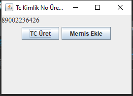

# 'TCNo-Generator' application
## What is 'TCNo-Generator' project ?
* This project is an maven project for generate random Republic of Turkey Identity Number (TC Number). 
* Voluntarily writed this app for my company. The purpose of this application is generate random TC No numbers and use it. Also, projects has a button for insert database this TC No records. You can customize the button according to your project and asign records to tables such as mernis in your database. 
#### The 'TCNo-Generator' application, its appearance and design e are as follows:

## How does it work ?
You can clone the project from this repo to your own computer and run this project from within Android Studio.

